# Design Document - Sidebar Taskmaster Dashboard

## Overview

The Sidebar Taskmaster Dashboard is a new UI module within the enterprise-ai-context-extension that provides developers with an intelligent task management interface. This module leverages the existing MCP server architecture and ContextManager to display tasks from the tasks.md file in a split-panel VSCode sidebar view. The design follows the established patterns of the extension while introducing new UI components for task management.

## Architecture

### High-Level Architecture

```mermaid
graph TB
    subgraph "VSCode Extension Host"
        EXT[VSCode Extension]
        TTV[Task Tree View]
        TDC[Task Detail Card]
        SB[Status Bar]
        TDS[TasksDataService]
    end

    subgraph "Local MCP Server Process"
        MCP[MCP Server]
        CTX[Context Manager]
        TSM[Task Status Manager]
        MTP[MarkdownTaskParser]
        MOCK[Mock Data Layer]
        MCACHE[Mock Cache (.aidm/mock-cache.json)]
    end

    subgraph "Data Sources"
        TASKS[tasks.md file]
        MOCK_DATA[Mock Task Data]
        TEST_RESULTS[Test Results]
    end

    EXT --> TDS
    TDS --> MCP : JSON-RPC
    TTV --> EXT
    TDC --> EXT
    SB --> EXT

    MCP --> CTX
    CTX --> TSM
    TSM --> MTP
    MTP --> TASKS
    TSM --> MOCK_DATA
    TSM --> TEST_RESULTS
    TSM --> MCACHE

    subgraph "AI Assistants"
        AI1[RooCode]
        AI2[Gemini]
    end

    AI1 --> MCP : MCP Protocol
    AI2 --> MCP : MCP Protocol
```

### Component Separation

**VSCode Extension (UI Layer)**

- Manages VSCode-specific integrations (TreeView, commands, status bar)
- Handles user interactions and UI state
- Communicates with MCP server via TasksDataService
- Lightweight and focused on presentation logic

**TasksDataService (Data Layer)**

- Manages JSON-RPC communication with MCP server
- Handles caching and data synchronization
- Provides clean API for UI components
- Manages error handling and retry logic

**MCP Server (Business Logic Layer)**

- Implements task management functionality
- Manages task data retrieval and status updates
- Handles tasks.md file parsing and modification
- Provides JSON-RPC interface for VSCode extension

## Components and Interfaces

### VSCode Extension Components

#### Task Tree View Provider

```typescript
interface TaskTreeViewProvider extends vscode.TreeDataProvider<TaskTreeItem> {
  getTreeItem(element: TaskTreeItem): vscode.TreeItem;
  getChildren(element?: TaskTreeItem): Promise<TaskTreeItem[]>;
  refresh(): void;
  onDidChangeTreeData: vscode.EventEmitter<TaskTreeItem | undefined | null>;
  expandNode(taskId: string): void;
  collapseNode(taskId: string): void;
}

interface TaskTreeItem extends vscode.TreeItem {
  id: string;
  label: string;
  description?: string;
  iconPath?: vscode.ThemeIcon;
  contextValue: string;
  collapsibleState: vscode.TreeItemCollapsibleState;
  task: Task;
  hasChildren: boolean;
  dependencyLevel: number;
}
```

#### Task Detail Card Provider

```typescript
interface TaskDetailCardProvider {
  updateTaskDetails(task: Task): void;
  clearDetails(): void;
  showNoTaskSelected(): void;
  onTaskSelected: vscode.EventEmitter<Task>;
  onStatusChanged: vscode.EventEmitter<{
    taskId: string;
    newStatus: TaskStatus;
  }>;
  onTestResultsUpdated: vscode.EventEmitter<{
    taskId: string;
    testStatus: TestStatus;
  }>;
}
```

#### TasksDataService

```typescript
interface TasksDataService {
  getTasks(): Promise<Task[]>;
  getTaskById(id: string): Promise<Task | null>;
  updateTaskStatus(id: string, status: TaskStatus): Promise<boolean>;
  refreshTasks(): Promise<void>;
  getTaskDependencies(id: string): Promise<string[]>;
  getTestResults(taskId: string): Promise<TestStatus | null>;

  // Event emitters for UI synchronization
  onTasksUpdated: vscode.EventEmitter<Task[]>;
  onTaskStatusChanged: vscode.EventEmitter<{
    taskId: string;
    newStatus: TaskStatus;
  }>;
  onError: vscode.EventEmitter<TaskErrorResponse>;
}
```

#### Task Management Commands

```typescript
interface TaskCommands {
  refreshTasks(): Promise<void>;
  updateTaskStatus(taskId: string, status: TaskStatus): Promise<void>;
  openTaskInEditor(taskId: string): void;
  showTaskHistory(taskId: string): void;
  viewTestResults(taskId: string): void;
  reportTaskIssue(taskId: string): void;
}
```

### MCP Server Components

#### Task Status Manager

```typescript
interface TaskStatusManager {
  getTasks(): Promise<Task[]>;
  getTaskById(id: string): Promise<Task | null>;
  updateTaskStatus(id: string, status: TaskStatus): Promise<boolean>;
  refreshTasksFromFile(): Promise<void>;
  getTaskDependencies(id: string): Promise<string[]>;
  getTestResults(taskId: string): Promise<TestStatus | null>;
  validateStatusTransition(
    currentStatus: TaskStatus,
    newStatus: TaskStatus
  ): boolean;
}

interface Task {
  id: string;
  title: string;
  description: string;
  status: TaskStatus;
  complexity: TaskComplexity;
  dependencies: string[];
  requirements: string[];
  createdDate: Date;
  lastModified: Date;
  assignee?: string;
  estimatedHours?: number;
  actualHours?: number;
  testStatus?: TestStatus;
  tags?: string[];
  priority?: TaskPriority;
}

interface TestStatus {
  lastRunDate?: Date;
  totalTests: number;
  passedTests: number;
  failedTests: number;
  failingTestsList?: { name: string; message: string; stackTrace?: string }[];
  testSuite?: string;
  coverage?: number;
}

enum TaskStatus {
  NOT_STARTED = "not_started",
  IN_PROGRESS = "in_progress",
  REVIEW = "review",
  COMPLETED = "completed",
  BLOCKED = "blocked",
  DEPRECATED = "deprecated",
}

enum TaskComplexity {
  LOW = "low",
  MEDIUM = "medium",
  HIGH = "high",
  EXTREME = "extreme",
}

enum TaskPriority {
  LOW = "low",
  MEDIUM = "medium",
  HIGH = "high",
  CRITICAL = "critical",
}
```

#### MarkdownTaskParser

```typescript
interface MarkdownTaskParser {
  parseTasksFromFile(filePath: string): Promise<Task[]>;
  parseTaskFromMarkdown(markdown: string): Task | null;
  validateTaskData(task: Task): ValidationResult;
  serializeTaskToMarkdown(task: Task): string;
  updateTaskInFile(
    filePath: string,
    taskId: string,
    updates: Partial<Task>
  ): Promise<boolean>;
}

interface ValidationResult {
  isValid: boolean;
  errors: string[];
  warnings: string[];
}
```

#### Enhanced Context Manager

```typescript
interface EnhancedContextManager extends ContextManager {
  getTaskContext(taskId: string): Promise<TaskContext>;
  getTasksForFile(filePath: string): Promise<Task[]>;
  getTasksByStatus(status: TaskStatus): Promise<Task[]>;
  getTasksByRequirement(requirementId: string): Promise<Task[]>;
  getTasksByPriority(priority: TaskPriority): Promise<Task[]>;
  getTasksByAssignee(assignee: string): Promise<Task[]>;
}

interface TaskContext {
  task: Task;
  relatedRequirements: Requirement[];
  codeMappings: CodeMapping[];
  businessContext: BusinessContext;
  dependencies: Task[];
  blockers: Task[];
  testResults?: TestStatus;
  estimatedCompletion?: Date;
}
```

### Data Models

#### Task Data Structure

```typescript
interface TaskData {
  tasks: Task[];
  metadata: {
    lastUpdated: Date;
    totalTasks: number;
    completedTasks: number;
    inProgressTasks: number;
    blockedTasks: number;
    testCoverage: number;
    averageComplexity: TaskComplexity;
  };
  relationships: {
    taskDependencies: Record<string, string[]>;
    requirementMappings: Record<string, string[]>;
    fileMappings: Record<string, string[]>;
    testMappings: Record<string, string[]>;
  };
  performance: {
    lastRefreshTime: Date;
    refreshDuration: number;
    cacheHitRate: number;
  };
}
```

#### Enhanced JSON-RPC Communication

```typescript
interface TaskJSONRPCRequest extends JSONRPCRequest {
  method:
    | "tasks/list"
    | "tasks/get"
    | "tasks/update-status"
    | "tasks/refresh"
    | "tasks/dependencies"
    | "tasks/test-results";
  params?: any;
  client_id?: string;
  session_token?: string;
  timestamp: number;
}

interface TaskJSONRPCResponse extends JSONRPCResponse {
  result?: Task | Task[] | boolean | string[] | TestStatus;
  error?: JSONRPCError;
  metadata?: {
    responseTime: number;
    cacheStatus: "hit" | "miss" | "stale";
    serverVersion: string;
  };
}
```

## UI/UX Design

### Split-Panel Layout

```mermaid
graph TB
    subgraph "VSCode Sidebar"
        subgraph "Top Panel - Task Tree View"
            TTV[Task Tree View]
            TTV --> T1[⚙️ Task 1.1 - Setup Project Structure]
            TTV --> T2[🔄 Task 1.2 - Implement Data Models]
            TTV --> T3[📄 Task 2.1 - Create Storage Mechanism]
        end

        subgraph "Bottom Panel - Task Detail Card"
            TDC[Task Detail Card]
            TDC --> TD[Task Details]
            TD --> TITLE[Title: Implement Data Models]
            TD --> DESC[Description: Create core data model interfaces...]
            TD --> STATUS[Status: In Progress ▼]
            TD --> COMPLEXITY[Complexity: Medium]
            TD --> DEPS[Dependencies: Task 1.1]
            TD --> TESTS[Tests: 15/20 passed ✅]
            TD --> ACTIONS[Actions: Generate Code, Review with RooCode]
        end
    end
```



### Task Tree View Design

**Visual Hierarchy**

- **Root Level**: Project/Module grouping with collapsible nodes
- **Second Level**: Individual tasks with status indicators and expandable details
- **Third Level**: Sub-tasks, dependencies, and test results

**Enhanced Status Indicators**

- 🟢 Not Started (default) - Simple circle
- ⚙️ In Progress - Gear icon indicating work in progress
- 📄 Review - Document icon for review phase
- ✅ Completed - Checkmark for completed tasks
- 🔴 Blocked - Warning icon for blocked tasks
- ⚫ Deprecated - X icon for deprecated tasks

**Task Information Display**

- Task ID (e.g., "1.2") with hierarchical numbering
- Task Title (truncated if too long with tooltip for full text)
- Status badge with color coding and icon
- Dependency indicator (chain link icon if dependencies exist)
- Test status indicator (small badge showing pass/fail ratio)
- Priority indicator (colored dot for high/critical priority)

**Interactive Features**

- Click to expand/collapse task nodes
- Right-click context menu for quick actions
- Drag and drop for reordering (future enhancement)
- Keyboard navigation support (arrow keys, enter, space)

### Task Detail Card Design

**Enhanced Information Layout**

```
┌─────────────────────────────────────┐
│ Task 1.2: Implement Data Models    │
├─────────────────────────────────────┤
│ Description:                        │
│ Create core data model interfaces   │
│ and types for the system...        │
│                                     │
│ Complexity: Medium                  │
│ Priority: High                      │
│ Status: In Progress [▼]            │
│ Dependencies: Task 1.1             │
│ Requirements: 1.2, 3.3, 1.2       │
│                                     │
│ Test Results: 15/20 passed ✅      │
│ [View Details ▼]                    │
│                                     │
│ [Generate Code] [Review] [History] │
└─────────────────────────────────────┘
```

**Test Results Section (Collapsible)**

```
┌─ Test Results ─────────────────────┐
│ Total Tests: 20                    │
│ Passed: 15 ✅                      │
│ Failed: 5 ❌                       │
│ Coverage: 75%                      │
│                                     │
│ Failing Tests:                     │
│ • testUserValidation - "Invalid..." │
│ • testDataPersistence - "Timeout"   │
│ [View Full Report]                 │
└─────────────────────────────────────┘
```

**No Task Selected State**

```
┌─────────────────────────────────────┐
│ 📋 No Task Selected                │
├─────────────────────────────────────┤
│                                     │
│ Select a task from the tree view   │
│ above to see detailed information. │
│                                     │
│ [Refresh Tasks] [View All Tasks]   │
└─────────────────────────────────────┘
```

**Interactive Elements**

- Status dropdown with validation (prevents invalid transitions)
- Action buttons for common operations (Generate Code, Review, History)
- Expandable sections for detailed information
- Links to related requirements, code, and test reports
- Quick action toolbar for frequently used operations

## Error Handling

### Task-Specific Error Categories

**Data Retrieval Errors**

- Tasks.md file not found → Use mock data with warning banner
- File parsing errors → Display error message with retry option and file path
- Invalid task data → Skip invalid tasks, log warnings, show data quality indicator

**Status Update Errors**

- File write permissions → Show error message, suggest manual update, provide file path
- Invalid status transitions → Validate before sending to server, show transition rules
- Network communication failures → Queue updates for retry, show offline indicator

**UI Synchronization Errors**

- Tree view refresh failures → Show cached data with staleness indicator and refresh button
- Detail panel update failures → Clear panel, show error message, provide fallback view
- State inconsistency → Force refresh from server, show sync status indicator

**Test Results Errors**

- Test data unavailable → Show "No Test Data" indicator with setup instructions
- Test execution failures → Display error message with retry option
- Coverage data missing → Show partial results with data availability warning

### Enhanced Error Response Format

```typescript
interface TaskErrorResponse extends ErrorResponse {
  taskId?: string;
  operation:
    | "task_retrieval"
    | "status_update"
    | "dependency_resolution"
    | "test_results";
  suggestedAction?:
    | "retry"
    | "manual_update"
    | "refresh"
    | "clear_cache"
    | "check_permissions";
  retryAfter?: number; // seconds
  userInstructions?: string;
  technicalDetails?: string;
  supportContact?: string;
}
```

### Graceful Degradation

1. **MCP Server Unavailable** → Show cached task data with connection warning and offline mode indicator
2. **Tasks.md File Unreadable** → Use mock task data for demonstration with prominent warning banner
3. **Status Updates Failing** → Disable status editing, show manual update instructions with file path
4. **UI Component Failures** → Fall back to basic list view with minimal functionality and error reporting
5. **Test Results Unavailable** → Show placeholder with setup instructions and manual refresh option

## Testing Strategy

### Enhanced Test Pyramid Structure

**Unit Tests (70%)**

- Task data parsing and validation (MarkdownTaskParser)
- Status transition logic and validation
- Tree view data provider and item rendering
- Detail card rendering and state management
- Error handling scenarios and recovery
- Test status parsing and display logic
- Cache management and invalidation

**Integration Tests (20%)**

- VSCode extension ↔ MCP server communication
- Task status update flow and file persistence
- UI synchronization between panels
- Cache invalidation and updates
- Error handling integration with existing systems
- Test results integration and display

**End-to-End Tests (10%)**

- Complete task management workflows
- Error recovery scenarios and user experience
- Performance benchmarks under load
- User interaction testing and accessibility
- **Critical E2E Test**: Full round-trip workflow
  - UI action (status dropdown change) → API call to Local MCP → tasks.md file modification → file system watcher → UI refresh → change reflection

### Enhanced Mock Strategy

**Development Mocks**

```typescript
interface MockTaskConfiguration {
  taskCount: number;
  complexityDistribution: Record<TaskComplexity, number>;
  statusDistribution: Record<TaskStatus, number>;
  dependencyDepth: number;
  includeSubTasks: boolean;
  testDataCoverage: number; // percentage of tasks with test data
  errorScenarios: MockErrorScenario[];
}

interface MockErrorScenario {
  type:
    | "file_not_found"
    | "parse_error"
    | "permission_denied"
    | "network_timeout";
  frequency: number; // percentage of requests that should fail
  recoveryTime: number; // seconds before auto-recovery
}
```

**Test Data Patterns**

- Realistic enterprise task hierarchies with complex dependencies
- Various complexity and status combinations
- Edge cases (circular dependencies, orphaned tasks, malformed data)
- Test results with various pass/fail ratios and coverage levels
- Large datasets (500+ line tasks.md files) for performance testing

### Performance Testing

**Response Time Targets**

- Task tree display: <300ms (cached data + optimized rendering)
- Task detail loading: <200ms (immediate for selected task)
- Status updates: <500ms (server communication + UI update)
- Tree refresh: <400ms (file parsing + cache update)
- Test results display: <150ms (cached test data)

**Load Testing Scenarios**

- Large task lists (100+ tasks with complex dependencies)
- Complex dependency trees (5+ levels deep)
- Multiple concurrent status updates (10+ simultaneous)
- Extended session memory usage (8+ hours of continuous use)
- **Large File Performance**: 500+ line tasks.md with complex markdown formatting

**Performance Monitoring**

- Memory usage tracking during extended sessions
- Cache hit/miss ratio monitoring
- UI render time measurement
- Network request latency tracking
- File I/O performance monitoring

## Security Considerations

### Enhanced Data Protection

- No sensitive task information in logs (sanitize descriptions and comments)
- Secure inter-process communication with request validation
- Input sanitization for task updates and user input
- Audit trail for all task modifications with user context
- Test result data protection (no sensitive error details in logs)

### Enterprise Compliance

- Task data retention policies with configurable expiration
- User access logging for all task operations with timestamps
- Secure credential management for future integrations
- Network security for MCP server communication
- Data classification and handling procedures

### Authentication Framework (Future)

```typescript
interface TaskAuthenticationProvider {
  authenticateUser(credentials: Credentials): Promise<AuthToken>;
  validateUserPermission(
    userId: string,
    operation: TaskOperation
  ): Promise<boolean>;
  logUserAction(
    userId: string,
    action: TaskAction,
    details: any
  ): Promise<void>;
  getAuditTrail(userId: string, dateRange: DateRange): Promise<AuditEntry[]>;
}
```

## Performance Optimization

### Enhanced Caching Strategy

**Multi-Level Task Data Caching**

- **Memory Cache**: Active tasks and recent selections (<100ms)
- **File Cache**: Parsed tasks.md content (<200ms)
- **Mock Cache**: Demonstration data for rapid iteration (<50ms)
- **Test Results Cache**: Test status and coverage data (<150ms)

**UI Performance Optimizations**

- Lazy loading of task details and test results
- Debounced status updates (300ms delay)
- Virtual scrolling for large task lists (100+ items)
- Efficient tree view rendering with item recycling
- Background data prefetching for adjacent tasks

### Response Time Architecture

**Local Performance Targets**

- Task tree display: <300ms (cached data + optimized rendering)
- Task detail loading: <200ms (immediate for selected task)
- Status updates: <500ms (server communication + UI update)
- Tree refresh: <400ms (file parsing + cache update)
- Test results display: <150ms (cached test data)

**Performance Monitoring and Alerts**

- Real-time performance metrics display
- Performance degradation alerts
- Automatic performance optimization suggestions
- Performance history tracking and trending

## Integration Points

### Existing Extension Integration

**ContextManager Enhancement**

- Extend existing ContextManager with task-specific methods
- Leverage existing caching and error handling patterns
- Use established audit logging and security components
- Integrate with existing MockDataProvider for fallback scenarios

**MCP Server Integration**

- Add task management tools to existing SimpleMCPServer
- Extend JSON-RPC protocol with task endpoints
- Maintain compatibility with existing AI assistant integrations
- Leverage existing ProcessManager for server lifecycle

**UI Component Reuse**

- Extend existing StatusBarManager for task-related status
- Use established error handling and logging patterns
- Leverage existing configuration management
- Integrate with existing demo and configuration panels

### Future Enhancement Points

**Project Management Integration**

- Jira/ADO API integration for real task data
- Git integration for code-to-task mapping
- Team collaboration features and notifications
- Sprint planning and velocity tracking

**AI Assistant Enhancement**

- Task generation from requirements analysis
- Automated complexity assessment using ML
- Dependency analysis and optimization suggestions
- Test coverage recommendations

**Enterprise Features**

- Multi-user task assignment and tracking
- Role-based access control for task management
- Integration with enterprise SSO systems
- Advanced reporting and analytics dashboard

## Configuration and Deployment

### Enhanced Extension Configuration

```typescript
interface TaskmasterConfiguration {
  tasks: {
    autoRefresh: boolean;
    refreshInterval: number; // seconds
    maxTasksDisplayed: number;
    showCompletedTasks: boolean;
    showTestResults: boolean;
    enableVirtualScrolling: boolean;
  };
  ui: {
    treeViewHeight: number;
    detailCardHeight: number;
    statusColors: Record<TaskStatus, string>;
    enableAnimations: boolean;
    showPriorityIndicators: boolean;
    showTestStatus: boolean;
  };
  mcp: {
    taskEndpoint: string;
    updateTimeout: number;
    retryAttempts: number;
    enableCompression: boolean;
  };
  performance: {
    cacheSize: number;
    cacheTTL: number;
    enableBackgroundRefresh: boolean;
    maxConcurrentRequests: number;
  };
  testing: {
    enableTestResults: boolean;
    testDataCacheTTL: number;
    showTestCoverage: boolean;
    enableTestNotifications: boolean;
  };
}
```

### Enhanced Package.json Contributions

```json
{
  "contributes": {
    "views": {
      "explorer": [
        {
          "id": "aidm-vscode-extension.tasks-tree",
          "name": "Tasks",
          "when": "aidm-vscode-extension.enabled"
        }
      ]
    },
    "viewsContainers": {
      "activitybar": [
        {
          "id": "aidm-vscode-extension.taskmaster",
          "title": "Taskmaster",
          "icon": "resources/taskmaster-icon.svg"
        }
      ]
    },
    "commands": [
      {
        "command": "aidm-vscode-extension.refreshTasks",
        "title": "Refresh Tasks",
        "category": "Taskmaster"
      },
      {
        "command": "aidm-vscode-extension.updateTaskStatus",
        "title": "Update Task Status",
        "category": "Taskmaster"
      },
      {
        "command": "aidm-vscode-extension.viewTestResults",
        "title": "View Test Results",
        "category": "Taskmaster"
      },
      {
        "command": "aidm-vscode-extension.reportTaskIssue",
        "title": "Report Task Issue",
        "category": "Taskmaster"
      }
    ],
    "menus": {
      "view/title": [
        {
          "command": "aidm-vscode-extension.refreshTasks",
          "when": "view == aidm-vscode-extension.tasks-tree",
          "group": "navigation"
        }
      ],
      "view/item/context": [
        {
          "command": "aidm-vscode-extension.updateTaskStatus",
          "when": "view == aidm-vscode-extension.tasks-tree",
          "group": "inline"
        }
      ]
    }
  }
}
```

This enhanced design provides a comprehensive, enterprise-ready foundation for the Taskmaster Dashboard while maintaining consistency with the existing extension architecture. The split-panel approach optimizes screen real estate while providing both high-level overview and detailed task information. The integration with existing MCP server infrastructure ensures seamless operation and future extensibility. The addition of test results integration, enhanced error handling, and performance monitoring makes this a robust solution for enterprise development teams.
