# Updated Design Document - Sidebar Taskmaster Dashboard

## Overview

The Sidebar Taskmaster Dashboard is a new UI module within the enterprise-ai-context-extension that provides developers with an intelligent task management interface. This module leverages the existing MCP server architecture and ContextManager to display tasks from the tasks.md file in an expandable list VSCode sidebar view. The design follows the established patterns of the extension while introducing new UI components for task management and AI assistant integration.

## Architecture

**File Structure Note**: Implementation uses existing repo structure (`src/tasks/`, `src/services/`) rather than creating new `src/taskmaster/` directories.

### High-Level Architecture

```mermaid
graph TB
    subgraph "VSCode Extension Host"
        EXT[VSCode Extension]
        TTV[Task Tree View]
        TDC[Task Detail Card]
        SB[Status Bar]
        TDS[TasksDataService]
        CIS[CursorIntegrationService]
        TFU[TimeFormattingUtility]
    end

    subgraph "Local MCP Server Process"
        MCP[MCP Server]
        CTX[Context Manager]
        TSM[Task Status Manager]
        MTP[MarkdownTaskParser]
        MOCK[Mock Data Layer]
        MCACHE[Mock Cache (.aidm/mock-cache.json)]
    end

    subgraph "Data Sources"
        TASKS[tasks.md file]
        REQS[requirements.md]
        DESIGN[design.md]
        MOCK_DATA[Mock Task Data]
        TEST_RESULTS[Test Results]
    end

    subgraph "External AI Tools"
        CURSOR[Cursor AI]
        AI1[RooCode]
        AI2[Gemini]
    end

    EXT --> TDS
    EXT --> CIS
    EXT --> TFU
    TDS --> MCP : JSON-RPC
    TTV --> EXT
    TDC --> EXT
    SB --> EXT
    CIS --> CURSOR : API/Command

    MCP --> CTX
    CTX --> TSM
    TSM --> MTP
    MTP --> TASKS
    TSM --> MOCK_DATA
    TSM --> TEST_RESULTS
    TSM --> MCACHE

    CIS --> TASKS : Context Extraction
    CIS --> REQS : Requirements Mapping
    CIS --> DESIGN : Architecture Context

    AI1 --> MCP : MCP Protocol
    AI2 --> MCP : MCP Protocol
```

### Component Separation

**VSCode Extension (UI Layer)**

- Manages VSCode-specific integrations (TreeView, commands, status bar)
- Handles user interactions and UI state
- Communicates with MCP server via TasksDataService
- Integrates with Cursor AI through CursorIntegrationService
- Lightweight and focused on presentation logic

**TasksDataService (Data Layer)**

- Manages JSON-RPC communication with MCP server
- Handles caching and data synchronization
- Provides clean API for UI components
- Manages error handling and retry logic

**CursorIntegrationService (AI Integration Layer)**

- Extracts task context for AI prompt generation
- Manages communication with Cursor AI assistant
- Handles prompt template generation and customization
- Provides fallback mechanisms when Cursor unavailable

**MCP Server (Business Logic Layer)**

- Implements task management functionality
- Manages task data retrieval and status updates
- Handles tasks.md file parsing and modification
- Provides JSON-RPC interface for VSCode extension

## Components and Interfaces

### VSCode Extension Components

#### Task Tree View Provider

```typescript
interface TaskTreeViewProvider extends vscode.TreeDataProvider<TaskTreeItem> {
  getTreeItem(element: TaskTreeItem): vscode.TreeItem;
  getChildren(element?: TaskTreeItem): Promise<TaskTreeItem[]>;
  refresh(): void;
  onDidChangeTreeData: vscode.EventEmitter<TaskTreeItem | undefined | null>;
  expandNode(taskId: string): void;
  collapseNode(taskId: string): void;
  onTaskClick: vscode.EventEmitter<{ taskId: string; task: Task }>;
  formatTaskForDisplay(task: Task): TaskTreeItem;
}

interface TaskTreeItem extends vscode.TreeItem {
  id: string;
  label: string;
  description?: string;
  iconPath?: vscode.ThemeIcon;
  contextValue: string;
  collapsibleState: vscode.TreeItemCollapsibleState;
  task: Task;
  hasChildren: boolean;
  dependencyLevel: number;
  isExecutable: boolean; // true for not_started tasks
  estimatedDuration?: string; // "15-30 min"
  testSummary?: string; // "15/18 passed"
  statusDisplayName: string; // "not started", "in progress"
}
```

#### Task Detail Card Provider

```typescript
interface TaskDetailCardProvider {
  updateTaskDetails(task: Task): void;
  clearDetails(): void;
  showNoTaskSelected(): void;
  renderTestFailures(failures: FailingTest[]): string;
  renderExecutableActions(task: Task): string;
  renderStatusSpecificActions(task: Task): string;
  formatRelativeTime(isoDate: string): string; // "2 hours ago"

  onTaskSelected: vscode.EventEmitter<Task>;
  onStatusChanged: vscode.EventEmitter<{
    taskId: string;
    newStatus: TaskStatus;
  }>;
  onTestResultsUpdated: vscode.EventEmitter<{
    taskId: string;
    testStatus: TestStatus;
  }>;
  onCursorExecuteRequested: vscode.EventEmitter<{ taskId: string }>;
}
```

#### Time Formatting Utility

```typescript
interface TimeFormattingUtility {
  formatRelativeTime(isoDate: string): string;
  formatDuration(minutes: number): string;
  parseEstimatedDuration(duration: string): number; // "15-30 min" -> 22.5
}
```

#### Cursor Integration Service

```typescript
interface CursorIntegrationService {
  generatePromptFromTask(taskId: string): Promise<CursorPrompt>;
  extractTaskContext(task: Task): Promise<TaskExecutionContext>;
  triggerCursorChat(prompt: CursorPrompt): Promise<boolean>;
  validateCursorAvailability(): boolean;
  copyPromptToClipboard(prompt: CursorPrompt): Promise<void>;

  // Event emitters
  onPromptGenerated: vscode.EventEmitter<{
    taskId: string;
    prompt: CursorPrompt;
  }>;
  onCursorTriggered: vscode.EventEmitter<{ taskId: string; success: boolean }>;
  onError: vscode.EventEmitter<{ taskId: string; error: string }>;
}

interface TaskExecutionContext {
  task: Task;
  dependencies: Task[];
  relatedRequirements: string[];
  architecturalContext: string;
  codeReferences: string[];
  testRequirements: string[];
  implementationHints: string[];
  fileStructureContext: string;
}

interface CursorPrompt {
  title: string;
  context: string;
  instructions: string;
  codeReferences: string[];
  acceptanceCriteria: string[];
  dependencies: string[];
  implementationNotes: string[];
  testingRequirements: string[];
}
```

#### TasksDataService

```typescript
interface TasksDataService {
  getTasks(): Promise<Task[]>;
  getTaskById(id: string): Promise<Task | null>;
  updateTaskStatus(id: string, status: TaskStatus): Promise<boolean>;
  refreshTasks(): Promise<void>;
  getTaskDependencies(id: string): Promise<string[]>;
  getTestResults(taskId: string): Promise<TestStatus | null>;

  // Event emitters for UI synchronization
  onTasksUpdated: vscode.EventEmitter<Task[]>;
  onTaskStatusChanged: vscode.EventEmitter<{
    taskId: string;
    newStatus: TaskStatus;
  }>;
  onError: vscode.EventEmitter<TaskErrorResponse>;
}
```

#### Task Management Commands

```typescript
interface TaskCommands {
  refreshTasks(): Promise<void>;
  updateTaskStatus(taskId: string, status: TaskStatus): Promise<void>;
  openTaskInEditor(taskId: string): void;
  showTaskHistory(taskId: string): void;
  viewTestResults(taskId: string): void;
  reportTaskIssue(taskId: string): void;
  executeTaskWithCursor(taskId: string): Promise<void>;
  generateTaskPrompt(taskId: string): Promise<void>;
}
```

### MCP Server Components

#### Task Status Manager

```typescript
interface TaskStatusManager {
  getTasks(): Promise<Task[]>;
  getTaskById(id: string): Promise<Task | null>;
  updateTaskStatus(id: string, status: TaskStatus): Promise<boolean>;
  refreshTasksFromFile(): Promise<void>;
  getTaskDependencies(id: string): Promise<string[]>;
  getTestResults(taskId: string): Promise<TestStatus | null>;
  validateStatusTransition(
    currentStatus: TaskStatus,
    newStatus: TaskStatus
  ): boolean;
  getTaskContext(taskId: string): Promise<TaskContext>;
}

interface Task {
  id: string;
  title: string;
  description: string;
  status: TaskStatus;
  complexity: TaskComplexity;
  dependencies: string[];
  requirements: string[];
  createdDate: string; // ISO date string
  lastModified: string; // ISO date string
  assignee?: string;
  estimatedHours?: number;
  actualHours?: number;
  estimatedDuration?: string; // "15-30 min", "20-25 min"
  testStatus?: TestStatus;
  tags?: string[];
  priority?: TaskPriority;
  implementationNotes?: string[];
  acceptanceCriteria?: string[];
  isExecutable?: boolean; // For Cursor integration eligibility
}

interface TestStatus {
  lastRunDate?: string; // ISO date string
  totalTests: number;
  passedTests: number;
  failedTests: number;
  failingTestsList?: FailingTest[];
  testSuite?: string;
  coverage?: number;
}

interface FailingTest {
  name: string;
  message: string;
  stackTrace?: string;
  category: "assertion" | "type" | "filesystem" | "timeout" | "network";
}

enum TaskStatus {
  NOT_STARTED = "not_started",
  IN_PROGRESS = "in_progress",
  REVIEW = "review",
  COMPLETED = "completed",
  BLOCKED = "blocked",
  DEPRECATED = "deprecated",
}

// Status display mapping
const STATUS_DISPLAY_NAMES: Record<TaskStatus, string> = {
  [TaskStatus.NOT_STARTED]: "not started",
  [TaskStatus.IN_PROGRESS]: "in progress",
  [TaskStatus.REVIEW]: "review",
  [TaskStatus.COMPLETED]: "completed",
  [TaskStatus.BLOCKED]: "blocked",
  [TaskStatus.DEPRECATED]: "deprecated",
};

// Status-specific action configurations
const STATUS_ACTIONS: Record<TaskStatus, string[]> = {
  [TaskStatus.NOT_STARTED]: [
    "🤖 Execute with Cursor",
    "Generate Prompt",
    "View Requirements",
  ],
  [TaskStatus.IN_PROGRESS]: [
    "Continue Work",
    "Mark Complete",
    "View Dependencies",
  ],
  [TaskStatus.REVIEW]: [
    "Approve & Complete",
    "Request Changes",
    "View Implementation",
  ],
  [TaskStatus.COMPLETED]: ["View Code", "View Tests", "History"],
  [TaskStatus.BLOCKED]: [
    "View Blockers",
    "Update Dependencies",
    "Report Issue",
  ],
  [TaskStatus.DEPRECATED]: ["Archive", "View History"],
};
```

#### MarkdownTaskParser

```typescript
interface MarkdownTaskParser {
  parseTasksFromFile(filePath: string): Promise<Task[]>;
  parseTaskFromMarkdown(markdown: string): Task | null;
  validateTaskData(task: Task): ValidationResult;
  serializeTaskToMarkdown(task: Task): string;
  updateTaskInFile(
    filePath: string,
    taskId: string,
    updates: Partial<Task>
  ): Promise<boolean>;
  extractTaskContext(taskId: string): Promise<TaskExecutionContext>;
}

interface ValidationResult {
  isValid: boolean;
  errors: string[];
  warnings: string[];
}
```

#### Enhanced Context Manager

```typescript
interface EnhancedContextManager extends ContextManager {
  getTaskContext(taskId: string): Promise<TaskContext>;
  getTasksForFile(filePath: string): Promise<Task[]>;
  getTasksByStatus(status: TaskStatus): Promise<Task[]>;
  getTasksByRequirement(requirementId: string): Promise<Task[]>;
  getTasksByPriority(priority: TaskPriority): Promise<Task[]>;
  getTasksByAssignee(assignee: string): Promise<Task[]>;
  extractExecutionContext(taskId: string): Promise<TaskExecutionContext>;
}

interface TaskContext {
  task: Task;
  relatedRequirements: Requirement[];
  codeMappings: CodeMapping[];
  businessContext: BusinessContext;
  dependencies: Task[];
  blockers: Task[];
  testResults?: TestStatus;
  estimatedCompletion?: Date;
}
```

### Data Models

#### Enhanced Task Data Structure

```typescript
interface TaskData {
  tasks: Task[];
  metadata: {
    lastUpdated: string; // ISO date string
    totalTasks: number;
    completedTasks: number;
    inProgressTasks: number;
    blockedTasks: number;
    executableTasks: number; // not_started tasks
    testCoverage: number;
    averageComplexity: TaskComplexity;
  };
  relationships: {
    taskDependencies: Record<string, string[]>;
    requirementMappings: Record<string, string[]>;
    fileMappings: Record<string, string[]>;
    testMappings: Record<string, string[]>;
  };
  performance: {
    lastRefreshTime: string; // ISO date string
    refreshDuration: number;
    cacheHitRate: number;
  };
}
```

#### Mock Data Examples

```typescript
// Example executable task (not_started)
const executableTask: Task = {
  id: "3.1.2",
  title: "Add TaskTreeItem status indicator property",
  description:
    "Add iconPath property with status-based theme icons to TaskTreeItem. Implement logic to assign appropriate icons based on task status.",
  status: TaskStatus.NOT_STARTED,
  complexity: TaskComplexity.LOW,
  estimatedDuration: "15-20 min",
  dependencies: ["3.1.1", "2.2"],
  requirements: ["2.2"],
  createdDate: "2024-08-22T10:00:00Z",
  lastModified: "2024-08-22T10:00:00Z",
  isExecutable: true,
  testStatus: null,
};

// Example completed task with test failures
const completedWithFailures: Task = {
  id: "2.5.3",
  title: "Add tasks/update-status tool to SimpleMCPServer",
  description:
    "Implement the tasks/update-status MCP tool in SimpleMCPServer to handle task status update requests from the VSCode extension.",
  status: TaskStatus.COMPLETED,
  complexity: TaskComplexity.MEDIUM,
  estimatedDuration: "25-30 min",
  dependencies: ["2.5.1", "2.5.2"],
  requirements: [],
  createdDate: "2024-08-22T09:00:00Z",
  lastModified: "2024-08-22T14:45:00Z",
  isExecutable: false,
  testStatus: {
    lastRunDate: "2024-08-22T13:15:00Z",
    totalTests: 18,
    passedTests: 15,
    failedTests: 3,
    failingTestsList: [
      {
        name: "should validate task status transitions",
        message: "AssertionError: Expected 400 but got 200",
        category: "assertion",
      },
      {
        name: "should handle invalid task IDs",
        message: "TypeError: Cannot read property 'id' of undefined",
        category: "type",
      },
      {
        name: "should persist status changes",
        message: "FileSystemError: Permission denied",
        category: "filesystem",
      },
    ],
    coverage: 85,
  },
};
```

#### Enhanced JSON-RPC Communication

```typescript
interface TaskJSONRPCRequest extends JSONRPCRequest {
  method:
    | "tasks/list"
    | "tasks/get"
    | "tasks/update-status"
    | "tasks/refresh"
    | "tasks/dependencies"
    | "tasks/test-results"
    | "tasks/context";
  params?: any;
  client_id?: string;
  session_token?: string;
  timestamp: number;
}

interface TaskJSONRPCResponse extends JSONRPCResponse {
  result?:
    | Task
    | Task[]
    | boolean
    | string[]
    | TestStatus
    | TaskExecutionContext;
  error?: JSONRPCError;
  metadata?: {
    responseTime: number;
    cacheStatus: "hit" | "miss" | "stale";
    serverVersion: string;
  };
}
```

## UI/UX Design

### Expandable List Layout

**Visual Hierarchy**

- **List Items**: Individual tasks with expandable details
- **Task Headers**: ID, title, status badge, and expand icon
- **Expanded Details**: Full description, metadata, test results, actions
- **Special Indicators**: Executable tasks show blue left border and 🤖 icon

**Enhanced Status Indicators**

- **not started**: Gray badge with 🤖 icon for executable tasks
- **in progress**: Blue badge with gear icon
- **review**: Yellow badge with document icon
- **completed**: Green badge with checkmark
- **blocked**: Red badge with warning icon
- **deprecated**: Dark badge with X icon

**Task Information Display**

- Task ID (monospace, colored background)
- Task Title (truncated with tooltip)
- Status badge (colored, with display name)
- Cursor executable indicator (🤖 icon + blue border)
- Estimated duration in metadata
- Test status summary badge

**Expandable Content Sections**

1. **Task Description**: Full description text
2. **Metadata Grid**: Complexity, estimated duration, dependencies
3. **Test Results**: Expandable section with pass/fail stats and collapsible failures
4. **Actions**: Status-specific button sets

**Test Results Display**

- Summary stats (Total/Passed/Failed)
- Last run timestamp ("Last run: 2 hours ago")
- Collapsible failing tests section
- Individual failure items with error categorization

### Split-Panel Layout

```mermaid
graph TB
    subgraph "VSCode Sidebar"
        subgraph "Top Panel - Task Tree View"
            TTV[Task Tree View]
            TTV --> T1[⚙️ Task 1.1 - Setup Project Structure]
            TTV --> T2[🔄 Task 1.2 - Implement Data Models]
            TTV --> T3[📄 Task 2.1 - Create Storage Mechanism]
            T1 --> EXECUTE1[🤖 Execute with Cursor]
            T2 --> EXECUTE2[🤖 Execute with Cursor]
        end

        subgraph "Bottom Panel - Task Detail Card"
            TDC[Task Detail Card]
            TDC --> TD[Task Details]
            TD --> TITLE[Title: Implement Data Models]
            TD --> DESC[Description: Create core data model interfaces...]
            TD --> STATUS[Status: In Progress ▼]
            TD --> COMPLEXITY[Complexity: Medium]
            TD --> DEPS[Dependencies: Task 1.1]
            TD --> TESTS[Tests: 15/20 passed ✅]
            TD --> ACTIONS[Actions: Generate Code, Review with RooCode, Execute with Cursor]
        end
    end
```



### Task Tree View Design

**Visual Hierarchy**

- **Root Level**: Project/Module grouping with collapsible nodes
- **Second Level**: Individual tasks with status indicators and expandable details
- **Third Level**: Sub-tasks, dependencies, and test results

**Enhanced Status Indicators**

- 🟢 Not Started (default) - Simple circle with cursor execute icon on hover
- ⚙️ In Progress - Gear icon indicating work in progress
- 📄 Review - Document icon for review phase
- ✅ Completed - Checkmark for completed tasks
- 🔴 Blocked - Warning icon for blocked tasks
- ⚫ Deprecated - X icon for deprecated tasks

**Task Information Display**

- Task ID (e.g., "1.2") with hierarchical numbering
- Task Title (truncated if too long with tooltip for full text)
- Status badge with color coding and icon
- Dependency indicator (chain link icon if dependencies exist)
- Test status indicator (small badge showing pass/fail ratio)
- Priority indicator (colored dot for high/critical priority)
- Cursor executable indicator (🤖 icon for not_started tasks)

**Interactive Features**

- Click to expand/collapse task nodes
- Click on executable tasks (not_started) to trigger Cursor integration
- Right-click context menu for quick actions
- Drag and drop for reordering (future enhancement)
- Keyboard navigation support (arrow keys, enter, space)

### Task Detail Card Design

**Enhanced Information Layout**

```
┌─────────────────────────────────────┐
│ Task 1.2: Implement Data Models    │
├─────────────────────────────────────┤
│ Description:                        │
│ Create core data model interfaces   │
│ and types for the system...        │
│                                     │
│ Complexity: Medium                  │
│ Priority: High                      │
│ Status: Not Started [▼]            │
│ Dependencies: Task 1.1             │
│ Requirements: 1.2, 3.3, 1.2       │
│                                     │
│ Test Results: No tests yet         │
│ [View Details ▼]                    │
│                                     │
│ [🤖 Execute with Cursor] [Generate Code] [Review] [History] │
└─────────────────────────────────────┘
```

**Cursor Integration Section**

```
┌─ AI Assistant Actions ─────────────┐
│ Status: Ready for implementation   │
│ 🤖 [Execute with Cursor]            │
│ 📋 [Generate Prompt Only]           │
│ ⚙️ [View Context Details]           │
│                                     │
│ Last AI interaction: Never         │
│ Context extracted: ✅              │
└─────────────────────────────────────┘
```

**Test Results Section (Collapsible)**

```
┌─ Test Results ─────────────────────┐
│ Total Tests: 20                    │
│ Passed: 15 ✅                      │
│ Failed: 5 ❌                       │
│ Coverage: 75%                      │
│                                     │
│ Failing Tests:                     │
│ • testUserValidation - "Invalid..." │
│ • testDataPersistence - "Timeout"   │
│ [View Full Report]                 │
└─────────────────────────────────────┘
```

**No Task Selected State**

```
┌─────────────────────────────────────┐
│ 📋 No Task Selected                │
├─────────────────────────────────────┤
│                                     │
│ Select a task from the tree view   │
│ above to see detailed information. │
│                                     │
│ Click on executable tasks (🤖) to  │
│ start implementation with AI.      │
│                                     │
│ [Refresh Tasks] [View All Tasks]   │
└─────────────────────────────────────┘
```

**Interactive Elements**

- Status dropdown with validation (prevents invalid transitions)
- Action buttons for common operations (Generate Code, Review, History)
- Cursor execution button for eligible tasks
- Expandable sections for detailed information
- Links to related requirements, code, and test reports
- Quick action toolbar for frequently used operations

## Cursor AI Integration

### Context Extraction Strategy

**Primary Data Sources**

- **tasks.md**: Task definition, dependencies, requirements, acceptance criteria
- **requirements.md**: Related user stories and acceptance criteria
- **design.md**: Architectural context, patterns, and component specifications
- **Project structure**: File organization and existing code patterns

**Context Extraction Pipeline**

1. **Task Analysis**

   - Parse task description and implementation notes
   - Identify dependencies and prerequisite tasks
   - Extract acceptance criteria and testing requirements

2. **Requirements Mapping**

   - Map task IDs to requirement sections
   - Extract related user stories and acceptance criteria
   - Include business context and user interaction patterns

3. **Architectural Context**

   - Identify relevant design patterns from design.md
   - Include interface definitions and type specifications
   - Add component integration patterns

4. **Code Context**
   - Analyze existing file structure
   - Identify implementation patterns and conventions
   - Include relevant imports and dependencies

### Prompt Generation Pipeline

**Template-Based Construction**

```typescript
interface PromptTemplate {
  title: string;
  sections: {
    context: string;
    task: string;
    requirements: string;
    architecture: string;
    implementation: string;
    testing: string;
    acceptance: string;
  };
  complexity_modifiers: Record<TaskComplexity, string[]>;
  priority_modifiers: Record<TaskPriority, string[]>;
}
```

**Dynamic Context Injection**

- Task complexity determines prompt detail level
- Priority affects urgency and quality indicators
- Dependencies include prerequisite context
- Requirements section includes mapped user stories

**Integration Strategy**

1. **VSCode Command Integration**

   - Register `cursor.executeTask` command
   - Use VSCode's command palette API
   - Trigger Cursor's chat interface programmatically

2. **Fallback Mechanisms**

   - Clipboard copy if Cursor API unavailable
   - Rich prompt formatting for manual paste
   - User notification with instructions

3. **Progress Tracking**
   - Visual feedback during prompt generation
   - Status updates in task detail panel
   - Error handling with retry options

**Example Generated Prompt Structure**

```
# Task Implementation: Create TaskTreeItem class with basic properties

## Context
You are implementing a VSCode extension component for the Sidebar Taskmaster Dashboard. This task is part of the UI foundation layer.

## Task Description
- **ID**: 3.1.1
- **Title**: Create TaskTreeItem class with basic properties
- **Complexity**: Low
- **Dependencies**: Tasks 1.1, 1.2 (completed)

## Requirements
From requirement 1.1: "WHEN the extension is activated THEN the system SHALL display a task tree view in the VSCode sidebar"

## Architecture
This component extends vscode.TreeItem and should follow the established patterns in the existing extension architecture.

## Implementation Details
[Extracted from design.md interfaces and existing patterns]

## Acceptance Criteria
- Implement TaskTreeItem extending vscode.TreeItem
- Add basic properties (label, description, contextValue)
- Write unit tests for TaskTreeItem creation

## Testing Requirements
Write focused unit tests for this specific functionality, not comprehensive suites.
```

## Error Handling

### Task-Specific Error Categories

**Data Retrieval Errors**

- Tasks.md file not found → Use mock data with warning banner
- File parsing errors → Display error message with retry option and file path
- Invalid task data → Skip invalid tasks, log warnings, show data quality indicator

**Status Update Errors**

- File write permissions → Show error message, suggest manual update, provide file path
- Invalid status transitions → Validate before sending to server, show transition rules
- Network communication failures → Queue updates for retry, show offline indicator

**Cursor Integration Errors**

- Cursor unavailable → Fall back to clipboard copy with notification
- Context extraction failures → Show partial context with warning
- Prompt generation errors → Provide manual prompt option
- API communication failures → Retry with exponential backoff

**UI Synchronization Errors**

- Tree view refresh failures → Show cached data with staleness indicator and refresh button
- Detail panel update failures → Clear panel, show error message, provide fallback view
- State inconsistency → Force refresh from server, show sync status indicator

**Test Results Errors**

- Test data unavailable → Show "No Test Data" indicator with setup instructions
- Test execution failures → Display error message with retry option
- Coverage data missing → Show partial results with data availability warning

### Enhanced Error Response Format

```typescript
interface TaskErrorResponse extends ErrorResponse {
  taskId?: string;
  operation:
    | "task_retrieval"
    | "status_update"
    | "dependency_resolution"
    | "test_results"
    | "cursor_integration"
    | "context_extraction"
    | "time_formatting";
  suggestedAction?:
    | "retry"
    | "manual_update"
    | "refresh"
    | "clear_cache"
    | "check_permissions"
    | "use_fallback";
  retryAfter?: number; // seconds
  userInstructions?: string;
  technicalDetails?: string;
  supportContact?: string;
  fallbackOptions?: string[];
}
```

### Graceful Degradation

1. **MCP Server Unavailable** → Show cached task data with connection warning and offline mode indicator
2. **Tasks.md File Unreadable** → Use mock task data for demonstration with prominent warning banner
3. **Status Updates Failing** → Disable status editing, show manual update instructions with file path
4. **Cursor Integration Failing** → Fall back to clipboard copy, disable AI features gracefully
5. **UI Component Failures** → Fall back to basic list view with minimal functionality and error reporting
6. **Test Results Unavailable** → Show placeholder with setup instructions and manual refresh option

## Testing Strategy

### Enhanced Test Pyramid Structure

**Unit Tests (70%)**

- Task data parsing and validation (MarkdownTaskParser)
- Status transition logic and validation
- Tree view data provider and item rendering
- Detail card rendering and state management
- Cursor integration service methods
- Context extraction and prompt generation
- Error handling scenarios and recovery
- Test status parsing and display logic
- Cache management and invalidation

**Integration Tests (20%)**

- VSCode extension ↔ MCP server communication
- Task status update flow and file persistence
- UI synchronization between panels
- Cursor integration workflow testing
- Cache invalidation and updates
- Error handling integration with existing systems
- Test results integration and display

**End-to-End Tests (10%)**

- Complete task management workflows
- Cursor execution workflow (with mocked Cursor API)
- Error recovery scenarios and user experience
- Performance benchmarks under load
- User interaction testing and accessibility
- **Critical E2E Test**: Full round-trip workflow
  - UI action (status dropdown change) → API call to Local MCP → tasks.md file modification → file system watcher → UI refresh → change reflection

### Enhanced Mock Strategy

**Development Mocks**

```typescript
interface MockTaskConfiguration {
  taskCount: number;
  complexityDistribution: Record<TaskComplexity, number>;
  statusDistribution: Record<TaskStatus, number>;
  dependencyDepth: number;
  includeSubTasks: boolean;
  testDataCoverage: number; // percentage of tasks with test data
  errorScenarios: MockErrorScenario[];
  cursorAvailable: boolean; // mock Cursor availability
}

interface MockErrorScenario {
  type:
    | "file_not_found"
    | "parse_error"
    | "permission_denied"
    | "network_timeout"
    | "cursor_unavailable"
    | "context_extraction_failed";
  frequency: number; // percentage of requests that should fail
  recoveryTime: number; // seconds before auto-recovery
}

interface MockCursorIntegration {
  simulateSuccess: boolean;
  responseDelay: number;
  failureRate: number;
  supportedCommands: string[];
}
```

**Test Data Patterns**

- Realistic enterprise task hierarchies with complex dependencies
- Various complexity and status combinations
- Edge cases (circular dependencies, orphaned tasks, malformed data)
- Test results with various pass/fail ratios and coverage levels
- Large datasets (500+ line tasks.md files) for performance testing
- Context extraction scenarios with missing or malformed data

### Performance Testing

**Response Time Targets**

- Task tree display: <300ms (cached data + optimized rendering)
- Task detail loading: <200ms (immediate for selected task)
- Status updates: <500ms (server communication + UI update)
- Tree refresh: <400ms (file parsing + cache update)
- Test results display: <150ms (cached test data)
- Context extraction: <800ms (file parsing + analysis)
- Prompt generation: <500ms (template processing)

**Load Testing Scenarios**

- Large task lists (100+ tasks with complex dependencies)
- Complex dependency trees (5+ levels deep)
- Multiple concurrent status updates (10+ simultaneous)
- Extended session memory usage (8+ hours of continuous use)
- **Large File Performance**: 500+ line tasks.md with complex markdown formatting
- Context extraction for large tasks with extensive dependencies

**Performance Monitoring**

- Memory usage tracking during extended sessions
- Cache hit/miss ratio monitoring
- UI render time measurement
- Network request latency tracking
- File I/O performance monitoring
- Context extraction timing and success rates

## Security Considerations

### Enhanced Data Protection

- No sensitive task information in logs (sanitize descriptions and comments)
- Secure inter-process communication with request validation
- Input sanitization for task updates and user input
- Audit trail for all task modifications with user context
- Test result data protection (no sensitive error details in logs)
- Cursor integration prompt sanitization (remove sensitive context)

### Enterprise Compliance

- Task data retention policies with configurable expiration
- User access logging for all task operations with timestamps
- Secure credential management for future integrations
- Network security for MCP server communication
- Data classification and handling procedures
- AI integration audit trails for compliance

### Authentication Framework (Future)

```typescript
interface TaskAuthenticationProvider {
  authenticateUser(credentials: Credentials): Promise<AuthToken>;
  validateUserPermission(
    userId: string,
    operation: TaskOperation
  ): Promise<boolean>;
  logUserAction(
    userId: string,
    action: TaskAction,
    details: any
  ): Promise<void>;
  getAuditTrail(userId: string, dateRange: DateRange): Promise<AuditEntry[]>;
  validateAIIntegration(userId: string, taskId: string): Promise<boolean>;
}
```

## Performance Optimization

### Enhanced Caching Strategy

**Multi-Level Task Data Caching**

- **Memory Cache**: Active tasks and recent selections (<100ms)
- **File Cache**: Parsed tasks.md content (<200ms)
- **Mock Cache**: Demonstration data for rapid iteration (<50ms)
- **Test Results Cache**: Test status and coverage data (<150ms)
- **Context Cache**: Extracted task context for prompt generation (<300ms)
- **Time Format Cache**: Relative time strings with 1-minute TTL

**UI Performance Optimizations**

- Lazy loading of task details and test results
- Debounced status updates (300ms delay)
- Virtual scrolling for large task lists (100+ items)
- Efficient list rendering with expand/collapse state management
- Background data prefetching for adjacent tasks
- Cached relative time formatting

### Response Time Architecture

**Local Performance Targets**

- Task tree display: <300ms (cached data + optimized rendering)
- Task detail loading: <200ms (immediate for selected task)
- Status updates: <500ms (server communication + UI update)
- Tree refresh: <400ms (file parsing + cache update)
- Test results display: <150ms (cached test data)
- Context extraction: <800ms (comprehensive analysis)
- Prompt generation: <500ms (template processing)

**Performance Monitoring and Alerts**

- Real-time performance metrics display
- Performance degradation alerts
- Automatic performance optimization suggestions
- Performance history tracking and trending
- Context extraction performance tracking

## Integration Points

### Existing Extension Integration

**ContextManager Enhancement**

- Extend existing ContextManager with task-specific methods
- Leverage existing caching and error handling patterns
- Use established audit logging and security components
- Integrate with existing MockDataProvider for fallback scenarios

**MCP Server Integration**

- Add task management tools to existing SimpleMCPServer
- Extend JSON-RPC protocol with task endpoints
- Maintain compatibility with existing AI assistant integrations
- Leverage existing ProcessManager for server lifecycle

**UI Component Reuse**

- Extend existing StatusBarManager for task-related status
- Use established error handling and logging patterns
- Leverage existing configuration management
- Integrate with existing demo and configuration panels

### Cursor AI Integration

**Integration Strategies**

1. **VSCode Extension API**

   - Use `vscode.commands.executeCommand()` to trigger Cursor
   - Register custom commands for AI integration
   - Leverage VSCode's clipboard API for fallback

2. **Command Line Integration**

   - Execute Cursor CLI commands with generated prompts
   - Use VSCode terminal integration for seamless experience
   - Handle different Cursor installation scenarios

3. **File-Based Integration**
   - Write prompts to temporary files for Cursor pickup
   - Use file watchers for integration feedback
   - Support various prompt file formats

**Context Extraction Architecture**

```typescript
interface ContextExtractor {
  extractFromMarkdown(
    filePath: string,
    taskId: string
  ): Promise<MarkdownContext>;
  extractFromRequirements(taskId: string): Promise<RequirementContext>;
  extractFromDesign(taskId: string): Promise<ArchitecturalContext>;
  extractFromCodebase(projectPath: string): Promise<CodebaseContext>;
  mergeContexts(contexts: Context[]): Promise<TaskExecutionContext>;
}
```

### Future Enhancement Points

**Project Management Integration**

- Jira/ADO API integration for real task data
- Git integration for code-to-task mapping
- Team collaboration features and notifications
- Sprint planning and velocity tracking

**AI Assistant Enhancement**

- Task generation from requirements analysis
- Automated complexity assessment using ML
- Dependency analysis and optimization suggestions
- Test coverage recommendations
- Multi-AI assistant support (Copilot, ChatGPT, etc.)

**Enterprise Features**

- Multi-user task assignment and tracking
- Role-based access control for task management
- Integration with enterprise SSO systems
- Advanced reporting and analytics dashboard

## Configuration and Deployment

### Enhanced Extension Configuration

```typescript
interface TaskmasterConfiguration {
  tasks: {
    autoRefresh: boolean;
    refreshInterval: number; // seconds
    maxTasksDisplayed: number;
    showCompletedTasks: boolean;
    showTestResults: boolean;
    enableVirtualScrolling: boolean;
    enableCursorIntegration: boolean;
    showExecutableIndicators: boolean;
  };
  ui: {
    listItemHeight: number;
    detailsPanelHeight: number;
    statusColors: Record<TaskStatus, string>;
    enableAnimations: boolean;
    showPriorityIndicators: boolean;
    showTestStatus: boolean;
    showAIActions: boolean;
    relativeTimeFormat: boolean; // "2 hours ago" vs absolute time
  };
  mcp: {
    taskEndpoint: string;
    updateTimeout: number;
    retryAttempts: number;
    enableCompression: boolean;
  };
  performance: {
    cacheSize: number;
    cacheTTL: number;
    enableBackgroundRefresh: boolean;
    maxConcurrentRequests: number;
    contextCacheTTL: number;
    timeFormatCacheTTL: number; // 60 seconds default
  };
  testing: {
    enableTestResults: boolean;
    testDataCacheTTL: number;
    showTestCoverage: boolean;
    enableTestNotifications: boolean;
    showFailureDetails: boolean;
  };
  ai: {
    cursorIntegration: {
      enabled: boolean;
      preferredTriggerMethod: "command" | "cli" | "file";
      fallbackToClipboard: boolean;
      contextDetailLevel: "minimal" | "standard" | "comprehensive";
      promptTemplate: string;
    };
    contextExtraction: {
      includeRequirements: boolean;
      includeArchitecture: boolean;
      includeCodeContext: boolean;
      maxContextLength: number;
    };
  };
}
```

## Data Contract & API Specifications

### MCP Server Response Format

- **Date Fields**: All date fields are returned as ISO 8601 strings
- **Response Structure**: Standard JSON-RPC 2.0 format with result.content[].text
- **Type Consistency**: All responses use string dates, never Date objects

### Mock Data Requirements

- **Date Format**: Use ISO 8601 strings in mock responses
- **Structure Match**: Mock responses must match real API response structure exactly
- **Validation**: Test data should be validated against API contracts before use

### Enhanced Package.json Contributions

```json
{
  "contributes": {
    "views": {
      "taskmaster": [
        {
          "id": "aidm-vscode-extension.tasks-list",
          "name": "Tasks",
          "when": "aidm-vscode-extension.enabled"
        }
      ]
    },
    "viewsContainers": {
      "activitybar": [
        {
          "id": "taskmaster",
          "title": "Taskmaster Dashboard",
          "icon": "$(checklist)"
        }
      ]
    },
    "commands": [
      {
        "command": "aidm-vscode-extension.refreshTasks",
        "title": "Refresh Tasks",
        "category": "Taskmaster",
        "icon": "$(refresh)"
      },
      {
        "command": "aidm-vscode-extension.updateTaskStatus",
        "title": "Update Task Status",
        "category": "Taskmaster"
      },
      {
        "command": "aidm-vscode-extension.viewTestResults",
        "title": "View Test Results",
        "category": "Taskmaster"
      },
      {
        "command": "aidm-vscode-extension.reportTaskIssue",
        "title": "Report Task Issue",
        "category": "Taskmaster"
      },
      {
        "command": "aidm-vscode-extension.executeTaskWithCursor",
        "title": "Execute Task with Cursor",
        "category": "Taskmaster",
        "icon": "$(robot)"
      },
      {
        "command": "aidm-vscode-extension.generateTaskPrompt",
        "title": "Generate AI Prompt",
        "category": "Taskmaster"
      },
      {
        "command": "aidm-vscode-extension.expandAllTasks",
        "title": "Expand All Tasks",
        "category": "Taskmaster"
      },
      {
        "command": "aidm-vscode-extension.collapseAllTasks",
        "title": "Collapse All Tasks",
        "category": "Taskmaster"
      }
    ],
    "menus": {
      "view/title": [
        {
          "command": "aidm-vscode-extension.refreshTasks",
          "when": "view == aidm-vscode-extension.tasks-list",
          "group": "navigation"
        }
      ],
      "view/item/context": [
        {
          "command": "aidm-vscode-extension.executeTaskWithCursor",
          "when": "view == aidm-vscode-extension.tasks-list && viewItem == executable-task",
          "group": "inline"
        },
        {
          "command": "aidm-vscode-extension.updateTaskStatus",
          "when": "view == aidm-vscode-extension.tasks-list",
          "group": "status"
        }
      ]
    }
  }
}
```

## Mockup Reference in Design.md

Add this section to your design.md:

```markdown
## UI Design Reference

### Visual Mockup Specification

The complete UI design for the sidebar is defined in `taskmaster_mockup.html`, which serves as the canonical reference for all visual implementation. This mockup demonstrates:

#### Layout Structure

- Expandable list design (not split panels)
- Task headers with expand/collapse functionality
- Accordion behavior (one task expanded at a time)
- Status badges with proper color coding
- Metadata grid layout for task details

#### Interactive Elements

- Click-to-expand task headers
- Collapsible test failure sections
- Status-specific action buttons
- Executable task indicators (blue border + 🤖 icon)

#### Visual States

- **not_started**: Gray badge, blue border if executable, 🤖 icon
- **in_progress**: Blue badge
- **review**: Yellow badge
- **completed**: Green badge
- **blocked**: Red badge

#### Test Results Display

- Summary statistics (total/passed/failed)
- Relative timestamps ("Last run: 2 hours ago")
- Collapsible failures section with error categorization
- Individual failure items with test names and error messages

#### Implementation Requirements

1. **Exact Visual Match**: All components must replicate the mockup styling precisely
2. **Responsive Design**: Maintain layout integrity across sidebar width changes
3. **Animation Consistency**: Smooth expand/collapse transitions matching mockup behavior
4. **Color Scheme Compliance**: Use exact colors and visual hierarchy from mockup
5. **Typography**: Match font sizes, weights, and spacing from mockup design

### Mockup Integration Guidelines

#### For UI Tasks

- Reference specific line numbers in taskmaster_mockup.html
- Copy exact CSS class structures and styling patterns
- Implement identical HTML hierarchy and container nesting
- Replicate all interactive behaviors and visual feedback

#### For Styling Tasks

- Extract CSS patterns directly from the mockup
- Maintain consistent spacing, colors, and typography
- Implement responsive design following mockup breakpoints
- Ensure visual accessibility while preserving design integrity

#### For Interactive Tasks

- Study click handlers and state management in mockup JavaScript
- Implement identical expand/collapse behavior patterns
- Match timing and animation characteristics exactly
- Replicate user feedback and visual state changes

The mockup serves as both the functional specification and the acceptance criteria for all UI-related implementation tasks.

This enhanced design provides a comprehensive, enterprise-ready foundation for the Taskmaster Dashboard while maintaining consistency with the existing extension architecture. The split-panel approach optimizes screen real estate while providing both high-level overview and detailed task information. The integration with existing MCP server infrastructure ensures seamless operation and future extensibility. The addition of Cursor AI integration, test results integration, enhanced error handling, and performance monitoring makes this a robust solution for enterprise development teams with modern AI-assisted development workflows.
```
