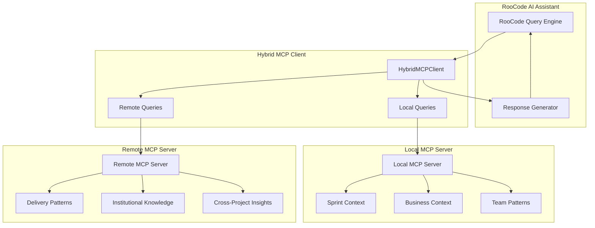

# RooCode Hybrid MCP Integration

This document describes how RooCode integrates with the hybrid MCP architecture to provide context-aware code suggestions using both local sprint context and remote delivery intelligence.

## Architecture Overview

The hybrid MCP architecture enables RooCode to access two types of context:

1. **Local Context** - Immediate sprint and project information
2. **Remote Intelligence** - Institutional knowledge and proven delivery patterns



## Query Types

### 1. Code Suggestion Queries

RooCode requests code suggestions with business context awareness.

**Query Format:**

```typescript
{
  type: "code_suggestion",
  filePath: "src/services/PaymentProcessor.ts",
  codeSnippet: "export class PaymentProcessor { ... }",
  technology: "typescript",
  userIntent: "Implement payment processing with error handling"
}
```

**Response Includes:**

- Enhanced code suggestions with sprint context
- Team coding pattern alignment
- Delivery pattern recommendations
- Business requirement traceability

### 2. Context Analysis Queries

RooCode analyzes existing code to understand business context and relationships.

**Query Format:**

```typescript
{
  type: "context_analysis",
  filePath: "src/models/User.ts",
  codeSnippet: "interface User { ... }",
  technology: "typescript",
  userIntent: "Understand business requirements for User model"
}
```

**Response Includes:**

- Current sprint alignment analysis
- Business requirement mapping
- Cross-project learning insights
- Stakeholder impact assessment

### 3. Delivery Guidance Queries

RooCode provides delivery guidance based on proven enterprise patterns.

**Query Format:**

```typescript
{
  type: "delivery_guidance",
  filePath: "src/components/Dashboard.tsx",
  codeSnippet: "const Dashboard = () => { ... }",
  technology: "react",
  userIntent: "Get delivery guidance following enterprise patterns"
}
```

**Response Includes:**

- Proven delivery pattern recommendations
- Method One alignment guidance
- Cross-project success insights
- Risk mitigation strategies

## Response Format

All RooCode responses follow a standardized hybrid format:

```typescript
interface RooCodeResponse {
  suggestion: string; // AI-generated suggestion or analysis
  localContext: {
    sprintAlignment: string; // How this relates to current sprint
    storyRelevance: string; // Connection to active user stories
    teamPatterns: string[]; // Applicable team coding patterns
  };
  remoteIntelligence: {
    deliveryPatterns: string[]; // Proven patterns from successful projects
    institutionalGuidance: string[]; // Best practices from knowledge base
    crossProjectLearnings: string[]; // Insights from similar implementations
  };
  hybridInsights: string[]; // Combined insights from local + remote
  confidence: number; // Confidence score (0.0 - 1.0)
  sources: string[]; // Data sources used for response
}
```

## Local Context Sources

### Sprint Context

- **Current Sprint Details**: Active sprint information, timeline, team members
- **Story Context**: Active user stories, acceptance criteria, business value
- **Team Patterns**: Coding standards, architectural decisions, best practices

### Business Context

- **Requirements Mapping**: Code-to-requirement traceability
- **Implementation Status**: Current development progress
- **Change History**: Recent modifications and their business impact

**Example Local Context:**

```typescript
{
  sprintDetails: {
    id: "sprint-2024-01",
    name: "Payment Integration Sprint",
    startDate: "2024-01-15",
    endDate: "2024-01-29",
    teamMembers: ["Alice", "Bob", "Charlie"],
    currentStories: ["PAY-123", "PAY-124"]
  },
  storyContext: {
    id: "PAY-123",
    title: "Implement secure payment processing",
    description: "Add payment processing with fraud detection",
    acceptanceCriteria: [
      "Support multiple payment methods",
      "Implement fraud detection",
      "Ensure PCI compliance"
    ],
    businessValue: "High",
    priority: "high",
    status: "in_progress"
  }
}
```

## Remote Intelligence Sources

### Delivery Patterns

- **Proven Methodologies**: Successful delivery approaches from similar projects
- **Technology-Specific Patterns**: Best practices for specific tech stacks
- **Success Metrics**: Historical success rates and performance data

### Institutional Knowledge

- **Best Practices**: Organizational standards and guidelines
- **Common Pitfalls**: Known issues and how to avoid them
- **Compliance Requirements**: Regulatory and security considerations

### Cross-Project Insights

- **Learning Database**: Insights from completed projects
- **Pattern Recognition**: Common solutions across different contexts
- **Risk Mitigation**: Proven strategies for handling challenges

**Example Remote Intelligence:**

```typescript
{
  deliveryPatterns: [
    {
      name: "Secure Payment Processing Pattern",
      technology: "typescript",
      successRate: 0.92,
      methodOneAlignment: "High",
      projectReferences: ["Project Alpha", "Project Beta"]
    }
  ],
  institutionalKnowledge: {
    domain: "payment-processing",
    bestPractices: [
      "Always validate payment data server-side",
      "Implement proper error handling for payment failures",
      "Use tokenization for sensitive payment data"
    ],
    commonPitfalls: [
      "Don't store raw payment data",
      "Avoid client-side payment validation only"
    ]
  }
}
```

## Performance Characteristics

### Response Times

- **Local Context**: < 200ms (cached sprint data)
- **Remote Intelligence**: < 2s (delivery patterns)
- **Hybrid Queries**: < 800ms (concurrent execution)
- **Concurrent Handling**: 3+ simultaneous AI assistants

### Optimization Strategies

- **Concurrent Execution**: Local and remote queries run in parallel
- **Intelligent Caching**: Frequently accessed patterns cached locally
- **Graceful Degradation**: Fallback to cached/mock data when services unavailable
- **Request Batching**: Multiple related queries combined for efficiency

## Fallback Behavior

### Local Server Unavailable

- Use cached sprint data from previous sessions
- Provide mock sprint context for demonstration
- Maintain basic team pattern guidance

### Remote Server Unavailable

- Use cached delivery patterns
- Provide general best practices
- Fall back to technology-specific guidance

### Both Servers Unavailable

- Offline mode with static guidance
- Basic code suggestions without context
- Clear indication of limited functionality

**Example Fallback Response:**

```typescript
{
  suggestion: "Working in offline mode with limited context...",
  localContext: {
    sprintAlignment: "Offline mode - no sprint context available",
    storyRelevance: "Offline mode - no story context available",
    teamPatterns: ["General TypeScript patterns"]
  },
  remoteIntelligence: {
    deliveryPatterns: ["Standard offline patterns"],
    institutionalGuidance: ["Follow TypeScript best practices"],
    crossProjectLearnings: ["Offline mode - limited insights"]
  },
  hybridInsights: ["Working in offline mode with limited context"],
  confidence: 0.3,
  sources: ["Offline fallback data"]
}
```

## Integration Examples

### Example 1: Payment Service Implementation

**RooCode Query:**

```typescript
{
  type: "code_suggestion",
  filePath: "src/services/PaymentService.ts",
  codeSnippet: `
    export class PaymentService {
      async processPayment(amount: number, method: string): Promise<PaymentResult> {
        // Need implementation
      }
    }
  `,
  technology: "typescript",
  userIntent: "Implement secure payment processing with fraud detection"
}
```

**Hybrid Response:**

```typescript
{
  suggestion: `
    Based on your current story "Implement secure payment processing" and proven
    delivery pattern "Secure Payment Processing Pattern", here's my suggestion:

    export class PaymentService {
      async processPayment(amount: number, method: string): Promise<PaymentResult> {
        // Validate input (sprint requirement: fraud detection)
        this.validatePaymentData(amount, method);

        // Apply proven pattern: tokenization
        const token = await this.tokenizePaymentData(method);

        // Process with fraud detection (story requirement)
        const fraudCheck = await this.fraudDetectionService.analyze(amount, token);
        if (!fraudCheck.isValid) {
          throw new PaymentError('Fraud detected', fraudCheck.reason);
        }

        // Process payment following enterprise pattern
        return await this.paymentGateway.process({
          amount,
          token,
          fraudScore: fraudCheck.score
        });
      }
    }
  `,
  localContext: {
    sprintAlignment: "Aligns with sprint 'Payment Integration Sprint' - story PAY-123",
    storyRelevance: "Directly implements 'Implement secure payment processing' story",
    teamPatterns: ["TypeScript Best Practices", "Error Handling Standards"]
  },
  remoteIntelligence: {
    deliveryPatterns: ["Secure Payment Processing Pattern (92% success rate)"],
    institutionalGuidance: [
      "Always validate payment data server-side",
      "Use tokenization for sensitive payment data"
    ],
    crossProjectLearnings: [
      "Teams using fraud detection patterns see 40% fewer payment issues"
    ]
  },
  hybridInsights: [
    "Current sprint 'Payment Integration Sprint' can benefit from 1 proven delivery pattern",
    "Story 'Implement secure payment processing' aligns with 2 institutional best practices"
  ],
  confidence: 0.89,
  sources: ["Local Sprint Context", "Remote Delivery Intelligence", "Team Patterns"]
}
```

### Example 2: Context Analysis for User Model

**RooCode Query:**

```typescript
{
  type: "context_analysis",
  filePath: "src/models/User.ts",
  codeSnippet: `
    interface User {
      id: string;
      email: string;
      profile: UserProfile;
      paymentMethods: PaymentMethod[];
    }
  `,
  technology: "typescript",
  userIntent: "Understand business context and relationships"
}
```

**Hybrid Response:**

```typescript
{
  suggestion: `
    Context Analysis for src/models/User.ts:

    **Sprint Context:**
    - Current Story: Implement secure payment processing
    - Business Value: High priority user authentication and payment integration
    - Sprint Progress: 2 active stories related to user management

    **Delivery Intelligence:**
    - Applicable Patterns: 2 proven user management patterns found
    - Success Rate: 87% for similar user model implementations
    - Cross-Project Insights: 3 relevant learnings from user management projects

    **Business Relationships:**
    - PaymentMethod relationship supports current payment processing story
    - UserProfile connection enables personalization features (future sprint)
    - Email field critical for authentication and notifications

    **Recommendations:**
    - Add validation for email format and uniqueness
    - Consider payment method encryption for PCI compliance
    - Implement user profile caching for performance
  `,
  localContext: {
    sprintAlignment: "User model supports current payment integration sprint",
    storyRelevance: "PaymentMethod relationship directly supports PAY-123 story",
    teamPatterns: ["Interface Design Standards", "Data Validation Patterns"]
  },
  remoteIntelligence: {
    deliveryPatterns: [
      "User Management Pattern (87% success rate)",
      "Payment Integration Pattern (92% success rate)"
    ],
    institutionalGuidance: [
      "Always encrypt sensitive user data",
      "Implement proper user validation",
      "Consider GDPR compliance for user data"
    ],
    crossProjectLearnings: [
      "Projects with proper user model validation see 35% fewer bugs",
      "Payment method integration requires careful security consideration",
      "User profile caching improves performance by 25%"
    ]
  },
  hybridInsights: [
    "User model design aligns with 2 proven delivery patterns",
    "Current sprint focus on payments makes PaymentMethod relationship critical",
    "Team validation patterns support institutional security guidance"
  ],
  confidence: 0.82,
  sources: ["Local Sprint Context", "Remote Delivery Intelligence", "Business Requirements"]
}
```

## Concurrent Request Handling

The hybrid architecture supports multiple simultaneous AI assistant requests:

### Concurrent Execution Pattern

```typescript
// Multiple RooCode instances can query simultaneously
const queries = [
  { type: "code_suggestion", filePath: "src/auth/AuthService.ts", ... },
  { type: "context_analysis", filePath: "src/models/Order.ts", ... },
  { type: "delivery_guidance", filePath: "src/api/PaymentAPI.ts", ... }
];

// All queries execute concurrently
const responses = await Promise.all(
  queries.map(query => hybridClient.processRooCodeQuery(query))
);
```

### Performance Optimization

- **Connection Pooling**: Reuse HTTP connections for multiple requests
- **Request Batching**: Combine related queries when possible
- **Intelligent Caching**: Cache frequently accessed patterns
- **Circuit Breaker**: Prevent cascade failures during high load

### Load Balancing

- **Local Server**: Handles immediate sprint context (fast response)
- **Remote Server**: Handles delivery intelligence (higher latency acceptable)
- **Hybrid Coordination**: Balances load between local and remote sources

## Testing and Validation

### Integration Tests

- **Connectivity Testing**: Verify local and remote server connections
- **Query Processing**: Test all query types with various inputs
- **Concurrent Handling**: Validate multiple simultaneous requests
- **Fallback Behavior**: Test graceful degradation scenarios

### Performance Tests

- **Response Time**: Measure query processing speed
- **Throughput**: Test concurrent request capacity
- **Memory Usage**: Monitor resource consumption
- **Cache Efficiency**: Validate caching performance

### Quality Assurance

- **Response Accuracy**: Verify suggestion quality and relevance
- **Context Alignment**: Ensure local and remote context integration
- **Confidence Scoring**: Validate confidence calculation accuracy
- **Error Handling**: Test error scenarios and recovery

## Configuration and Deployment

### Local MCP Server Configuration

```typescript
{
  port: 3000,
  timeout: 5000,
  cache: {
    enabled: true,
    ttl: 300000, // 5 minutes
    maxSize: 1000
  },
  mock: {
    enabled: true,
    dataSize: "medium",
    enterprisePatterns: true
  }
}
```

### Remote MCP Server Configuration

```typescript
{
  endpoint: "https://aidm-vscode-extension-remote-mcp.vercel.app/mcp",
  timeout: 10000,
  retryAttempts: 3,
  circuitBreaker: {
    enabled: true,
    threshold: 5,
    resetTimeout: 30000
  }
}
```

### RooCode Integration Settings

```typescript
{
  hybridMode: true,
  localPriority: true,        // Prefer local context when available
  remoteTimeout: 2000,        // Max wait time for remote intelligence
  fallbackEnabled: true,      // Enable graceful degradation
  concurrentLimit: 5,         // Max concurrent requests per client
  confidenceThreshold: 0.5    // Minimum confidence for suggestions
}
```

This hybrid integration enables RooCode to provide context-aware, enterprise-aligned code suggestions that combine immediate sprint needs with proven delivery intelligence from across the organization.
